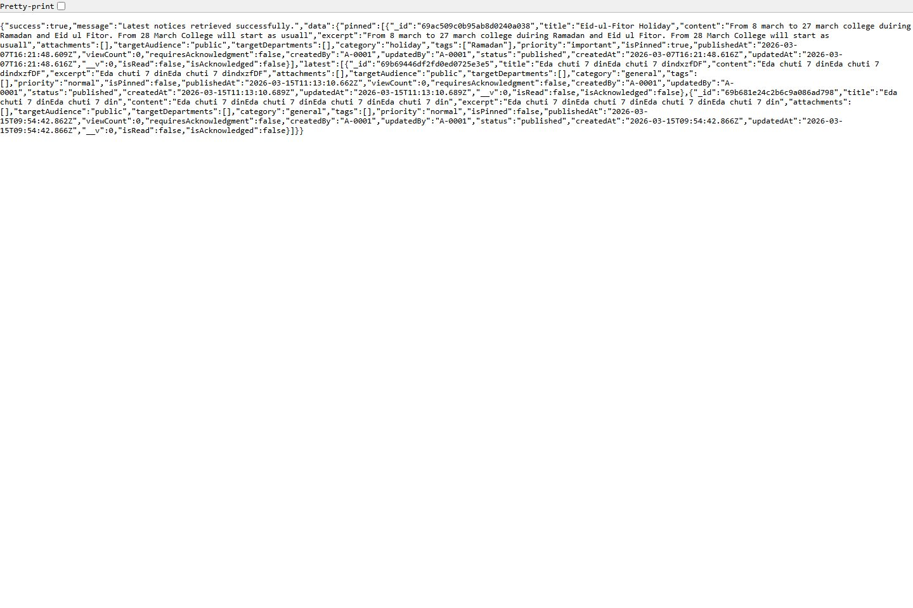
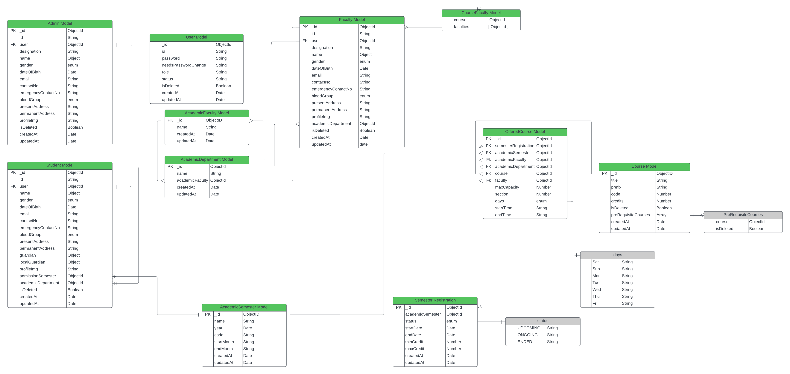

# PMS Backend

Production-ready Express and TypeScript backend for the Polytechnic Management System. This service powers authentication, academic workflows, realtime notifications, media uploads, public data delivery, and chatbot-assisted experiences for the PMS platform.

## Project Overview

| Item | Details |
| --- | --- |
| Live API Service | [https://pms-backend-3yl3.onrender.com/](https://pms-backend-3yl3.onrender.com/) |
| API Base URL | [https://pms-backend-3yl3.onrender.com/api/v1](https://pms-backend-3yl3.onrender.com/api/v1) |
| Health Check | [https://pms-backend-3yl3.onrender.com/health](https://pms-backend-3yl3.onrender.com/health) |
| Connected Frontend | [https://polytechnic-managment.vercel.app/](https://polytechnic-managment.vercel.app/) |
| Deployment | Render web service |
| Main Goal | Centralize secure academic operations, public content delivery, and realtime institutional communication |

This backend was built to solve the operational side of the project. Instead of keeping authentication, academic data, notices, attendance, notifications, and media handling in separate disconnected services, PMS Backend brings them together in one structured API layer that both the public website and dashboard can rely on.

## Problem Breakdown, Features, and Solutions

| Problem | Feature Added | Solution Outcome |
| --- | --- | --- |
| Academic and administrative data were spread across different manual or disconnected processes. | Modular REST API for students, instructors, admins, semesters, departments, subjects, curriculums, enrollments, classes, and attendance. | The frontend can manage the full academic workflow from one backend service. |
| Different users needed different levels of access to the same platform. | JWT authentication, refresh-token flow, role-based authorization, and status checks for `student`, `instructor`, `admin`, and `superAdmin`. | Sensitive operations stay protected while each user gets the right level of visibility. |
| Public visitors and authenticated users needed different data access patterns. | Public-friendly endpoints for notices, instructors, and chatbot access, plus protected dashboard APIs. | One backend can serve both the public website and secured institutional dashboards. |
| Important events needed to reach users quickly without constant page refresh. | Socket.IO-based realtime notification delivery with user rooms, role rooms, unread counters, and read/clear flows. | Users receive operational updates faster and the frontend stays more responsive. |
| Backend cold starts on free hosting could make the system feel unreliable. | Root route and `/health` endpoint for service visibility, monitoring, and frontend wake-up checks. | The platform can detect service readiness and communicate delays more gracefully. |
| Profile and media updates required reliable file handling. | Multer-based upload parsing and Cloudinary image delivery. | Profile image workflows stay manageable without storing heavy files directly in the app server. |
| Password recovery and account lifecycle handling needed to be production-aware. | Forget-password, reset-password, change-password, and seeded super-admin bootstrap flow. | Account access can be recovered safely and the system can initialize privileged access cleanly. |
| Public discovery needed AI-assisted help without building a separate service. | Chatbot module with validated `/chatbot/ask` API integration. | The frontend can provide quick academic Q&A from the same backend platform. |

## Development Challenges We Overcame

The backend grew into more than a CRUD API. Several engineering challenges had to be solved to keep it usable and scalable:

1. Role-safe access had to stay consistent across many modules.
   Shared auth middleware, user role constants, and route-level protection were used so sensitive endpoints behave predictably.
2. Academic data relationships are naturally complex.
   The project was split into focused modules for semesters, subjects, offered subjects, class sessions, enrollments, and attendance to keep business logic organized.
3. REST responses and realtime events needed to stay aligned.
   Socket rooms, notification services, and API unread-state endpoints were combined so the dashboard can reflect both stored and live status.
4. Free-tier deployment created first-request delays.
   A dedicated health endpoint was added so the frontend can detect backend readiness and soften the cold-start experience.
5. Media, email, and auth flows all introduce operational risk.
   Cloudinary uploads, email helpers, token-based password recovery, and config-driven environment handling were introduced to make these flows production-friendly.

## Project Screenshots and Architecture

The following assets show the deployed backend and the data structure behind it:

| Live API Root | Health Endpoint |
| --- | --- |
|  |  |

| Latest Notices API Preview | Entity Relationship Diagram |
| --- | --- |
|  |  |

## Features by User Type

### Public Visitors and Frontend Guests

- Fetch public notices, latest notices, and notice details without requiring full dashboard access.
- Read public academic instructor data for the institutional website.
- Use the chatbot endpoint for quick public-facing academic queries.
- Hit root and health endpoints for availability checks and deployment monitoring.

### Students

- Authenticate, refresh sessions, change password, and recover access.
- Access semester enrollments, enrolled subjects, class sessions, attendance, notices, notifications, and self-profile support.
- Mark notices as read or acknowledged and manage notification read state.

### Instructors

- Authenticate and access instructor-facing class, subject, curriculum, semester, notice, and notification workflows.
- Work with assigned academic data and classroom delivery records.
- Use protected APIs for teaching-related dashboard experiences.

### Admins

- Manage students, instructors, academic instructors, departments, semesters, subjects, curriculums, semester registrations, offered subjects, enrollments, notices, and class-session operations.
- Publish notices, supervise attendance-related flows, and trigger operational updates that appear in realtime on the frontend.

### Super Admins

- Access all admin-level backend capabilities.
- Bootstrap privileged control through seeded super-admin creation when the system starts with an empty database.
- Supervise admin-level access and high-privilege operational workflows.

## Core Backend Modules

- `Auth` - login, refresh token, logout, password change, forget-password, and reset-password flows.
- `User`, `Student`, `Instructor`, `Admin` - user lifecycle and role-aware account operations.
- `Academic Semester`, `Academic Department`, `Academic Instructor` - academic structure management.
- `Subject`, `Curriculum`, `Semester Registration`, `Offered Subject`, `Semester Enrollment`, `Enrolled Subject` - core academic delivery workflow.
- `Class Session`, `Student Attendance` - schedule and attendance tracking.
- `Notice`, `Notification` - communication, visibility, and realtime update support.
- `Chatbot` - validated public assistant endpoint.
- `Socket Service` - role rooms, user rooms, and event broadcasting.

## Tech Stack

- Node.js
- Express 5
- TypeScript
- MongoDB
- Mongoose
- JWT
- bcrypt
- Zod
- Joi
- Socket.IO
- Nodemailer
- Cloudinary
- Multer

## Repository Layout

- `src/server.ts` - connects MongoDB, seeds the super admin, initializes Socket.IO, and starts the HTTP server.
- `src/app.ts` - configures Express, CORS, parsers, routes, root response, and health endpoint.
- `src/app/routes/` - central API route registration.
- `src/app/modules/` - feature modules for auth, academics, classes, notices, notifications, chatbot, and user roles.
- `src/app/socket/` - socket middleware, types, and event delivery logic.
- `src/app/utils/` - shared helpers such as Cloudinary upload, email sending, and response wrappers.
- `src/app/config/` - environment and CORS configuration.
- `src/app/DB/` - startup database bootstrap logic, including seeded super-admin creation.
- `docs/screenshots/` - README preview assets captured from the deployed backend and ER diagram.

## API Surface Overview

Major route groups currently include:

- `/auth`
- `/users`
- `/students`
- `/instructors`
- `/admins`
- `/academic-semester`
- `/academic-instructor`
- `/academic-department`
- `/subjects`
- `/curriculums`
- `/semester-registrations`
- `/offered-subject`
- `/enrolled-subjects`
- `/semester-enrollments`
- `/class-sessions`
- `/student-attendance`
- `/notices`
- `/notifications`
- `/chatbot`

Base prefix:

```txt
/api/v1
```

Health endpoint:

```txt
GET /health
```

## Environment Variables

Create `backend/.env` and configure the following values:

```env
NODE_ENV=production
PORT=5000
DATABASE_URL=
BCRYPT_SALT_ROUNDS=12
DEFAULT_PASS=
JWT_ACCESS_SECRET=
JWT_REFRESH_SECRET=
JWT_ACCESS_EXPIRES_IN=1d
JWT_REFRESH_EXPIRES_IN=30d
RESET_PASS_UI_LINK=https://polytechnic-managment.vercel.app/reset-password
CLOUDINARY_CLOUD_NAME=
CLOUDINARY_API_KEY=
CLOUDINARY_API_SECRET=
SMTP_HOST=smtp.gmail.com
SMTP_PORT=587
SMTP_SECURE=false
SMTP_USER=
SMTP_PASS=
SMTP_FROM=
SUPER_ADMIN_PASSWORD=
CORS_ORIGINS=https://polytechnic-managment.vercel.app,http://localhost:3000
OPENROUTER_API_KEY=
OPENROUTER_MODEL=
OPENROUTER_SITE_URL=https://polytechnic-managment.vercel.app
```

Notes:

- `CORS_ORIGINS` accepts a comma-separated list.
- `RESET_PASS_UI_LINK` should point to the deployed frontend reset-password route.
- `SMTP_USER`, `SMTP_PASS`, and optional `SMTP_FROM` should come from your secret manager or deployment environment, never from source code.
- `OPENROUTER_*` values are only required if chatbot features are enabled.
- `SUPER_ADMIN_PASSWORD` is used during the initial super-admin seed flow.

## Local Development

```bash
cd backend
npm install
npm run start:dev
```

Default local API host:

```txt
http://localhost:5000
```

With the default API prefix:

```txt
http://localhost:5000/api/v1
```

## Available Scripts

- `npm run start:dev` starts the development server with automatic reload.
- `npm run build` compiles TypeScript to `dist/`.
- `npm run start` runs the compiled server.
- `npm run start:prod` runs the compiled server in production-style mode.
- `npm run lint` runs ESLint on `src`.
- `npm run lint:fix` runs ESLint with auto-fix.
- `npm run prettier` formats supported source files.
- `npm run prettier:fix` formats the `src` directory.
- `npm test` is currently a placeholder script and not yet configured with automated backend tests.

## Realtime Notes

Socket.IO is initialized during server startup and supports role-based or user-based delivery. This is used for events such as:

- notice publication
- class started, completed, cancelled, or missed updates
- attendance-related updates
- offered-subject assignment notifications

Because of this realtime layer, the backend is best deployed as a persistent Node service instead of a purely serverless API.

## Deployment Guidance

This backend is suitable for Render, Railway, VPS, or any persistent Node hosting environment.

### Recommended production settings

- Root directory: `backend`
- Build command: `npm ci --include=dev && npm run build`
- Start command: `npm run start`
- Health check path: `/health`

### Frontend integration

If the backend host is `https://your-backend-host.onrender.com`, set the frontend environment like this:

```env
NEXT_PUBLIC_API_BASE_URL=https://your-backend-host.onrender.com/api/v1
NEXT_PUBLIC_SOCKET_URL=https://your-backend-host.onrender.com
NEXT_PUBLIC_SITE_URL=https://polytechnic-managment.vercel.app
```

### Free-tier hosting note

This project is currently deployed on a Render free plan. After inactivity, the first request may be slower. The frontend already includes a wake-up modal that uses the backend health check to explain that delay more clearly to users.

## Quality and Maintenance

This backend is structured for ongoing growth:

- modular feature-based folders
- central route registration
- shared validation and error handling
- reusable auth and response helpers
- realtime delivery support through Socket.IO
- deployable health-check support for monitoring and UX coordination

## Demo Access

If you are using seeded local or controlled demo data, the following sample accounts may be available:

- Super Admin
  ID: `0001`
  Password: `admin12345`
- Admin
  ID: `A-0001`
  Password: `admin1234`
- Instructor
  ID: `I-0003`
  Password: `Instructor@123`
- Student
  ID: `2027010001`
  Password: `ruhul1234`

Use demo credentials only for local or controlled environments.
